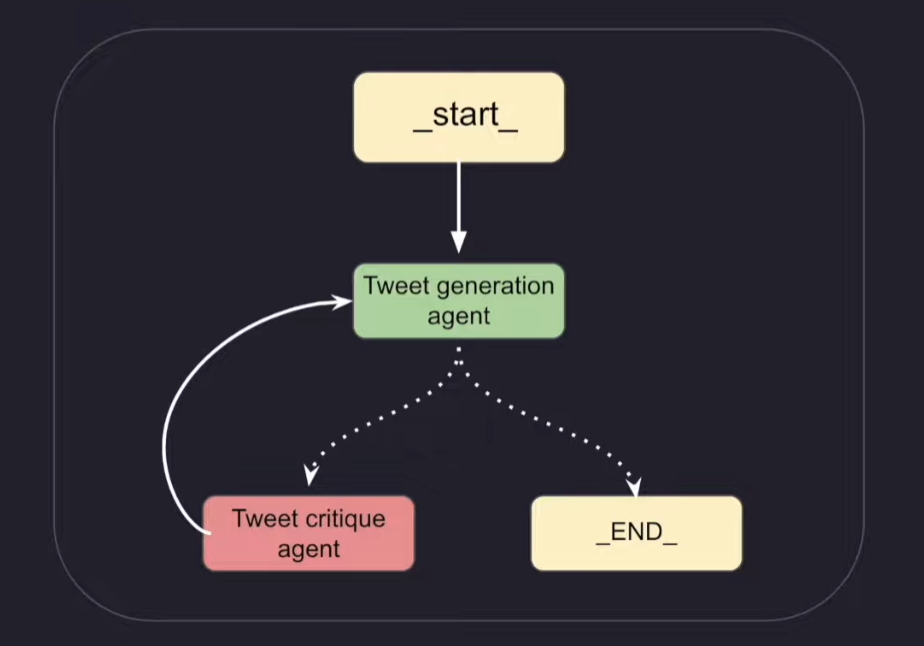

### Limitations of Langchain Agents
- Reflection agents in Langchain work in `thought-action-observation` loop.
- These agents are little flexible meaning that they execute the tools not in order. This creates issues in the runtime.
- If this chain doesn't get required answer, it keeps on executing infinitely. This is majos issue.
- To overcome this, `reflection agent` came into picture.

### Reflection agents in Langchain
- Reflection means looking at your yourself in mirror.
    eg. after writing email, reading how it is to rectify errors if any.

- `reflection-agent-pattern` is an AI system that can look at its own output and think about them to make it better
- A typical reflection system consists of:
    - *`generator agent`*
    - *`reflector agent (to review the output)`*

    

---

- Above figure shows typical reflection agent pattern.
- Tweet generation agent generates the tweet.
- Generated tweet is inspected by critique agent based on certain conditions given in the prompt like 'virality, vulgur content' etc.
- The feedback is given to tweet generator agent again and generator agent generates the tweet again.
- This loop continues unless it meets the given criteria.

### Types of Reflection agents in langgraph
- `Basic reflection agent`
- `Reflexion agent`
- `Language Agent Tree Search (LATS)`

### `Basic reflection agent`
- This is the agent which looks itself or its performance, judges it and tries to modify it based on the given conditions. This is `generation-reflection agent` system.
- Fig above shows generation-refletion system.

### Reflexion Agent
- This is the agent who generates a content, reviews it based on certain conditions, and additionally it also validaes the generated content using available tools under the hood to make answer even better.
- This agent is said to have `episodic memory`.
    - In the context of reflexion agents, Episodic memory refers to `agent's ability to recall specific past interactions, events or experiences rather than just generlized knowledge.`
    - This is helpful to make agent more context aware, personalize, human-like over time.

-Basically this system is like `accepting user input-generate initial response(contains: response, critique, search terms)-executes tools-revisor (revises the content) revises and generates new content and generates revised response-executes tools with new response-revisor.` This loop repeats n times and gives final result.